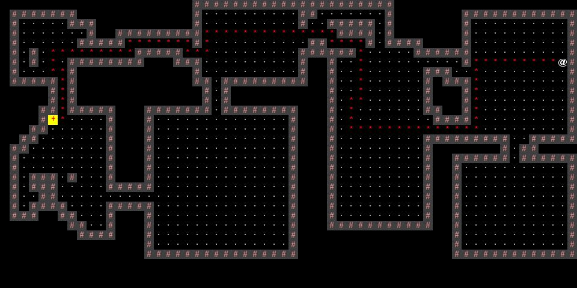
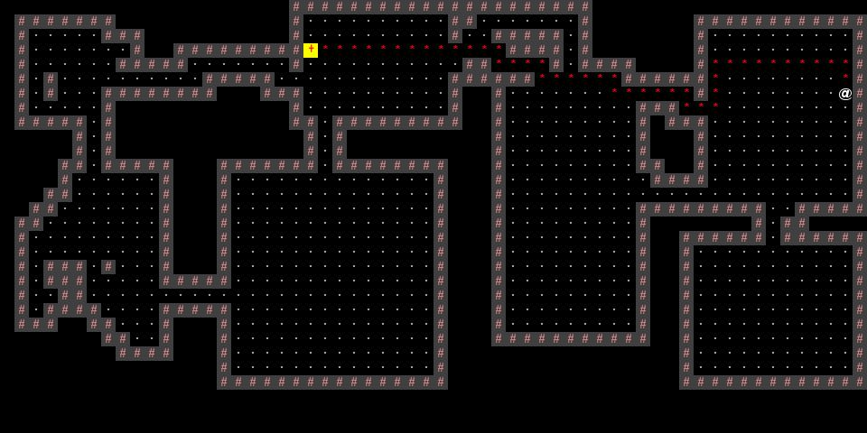
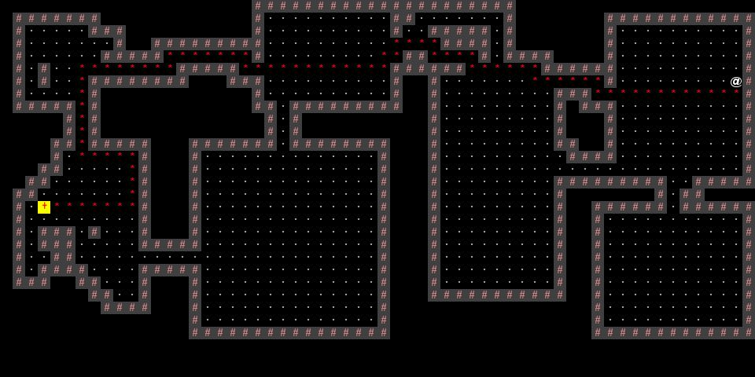

# BYOW

## Classes and Data Structures

### Class `Engine`

The `Engine` class handles the game's logic and controls the rendering of frames on the screen. It provides methods for interacting with keyboard input or input strings.

#### Fields

- `public void interactWithKeyboard()`
  - This method allows the user to control the avatar's movement in the game world by using the `w`, `a`, `s`, and `d` keys.
- `public TETile[][] interactWithInputString(String input)`
  - This method runs a game command based on the input string provided.

### Class `MapGenerator`

The `MapGenerator` class is responsible for creating a pixelated game world by using Binary Space Partition Tree (BSP-Tree) to generate rooms, which are then connected with corridors.

### Class `Room`

The `Room` class is an abstract class that defines the behavior of generated rooms. There are two types of rooms: square rooms and random walk rooms.

#### Fields

- `protected Point center`
  - This field is used for the purpose of connecting rooms.

### Class `SquareRoom` extends `Room`

The `SquareRoom` class represents rooms that are randomly generated by selecting a width and height within given bounds.

### Class `RandomWalkRoom` extends `Room`

The `RandomWalkRoom` class represents rooms that are generated using a random walk algorithm starting from a given point.

## Algorithms

### Map Generation by BSP-Tree

- Rooms:
  - The BSP-Tree algorithm splits a given space into two recursively, alternating the split direction in each iteration. During the split, the room centers are retained.
- Corridors:
  - The algorithm randomly selects a room center and connects it to its closest neighboring center. This process continues until all room centers are connected.

### Painter's Algorithm for Rendering

For each `FLOOR` pixel, the Painter's algorithm keeps track of the 8 neighboring pixels as `WALL` pixels.

During the rendering process, the `WALL` pixels are filled first, followed by the `FLOOR` pixels. The `FLOOR` pixels eventually override any `WALL` records, if present.

### Greedy Shortest Path (Suboptimal)

The enemy's movement in hunting the avatar is guided by the Greedy Best-First-Search algorithm, which is a combination of Breadth-First Search (BFS) and a Priority Queue. The goal of this algorithm is to find the shortest path from the enemy to the avatar.

In our implementation, the source point is the avatar's location, and the destination point is the enemy's location. The cost function `f(n) = h(n)` is used, where `h(n)` represents the Manhattan distance between the visited position `n` and the destination position.

The algorithm uses BFS to visit neighboring positions. For each position, the cost `f(n)` is calculated and added to the priority queue. A `HashSet` called `visited` is used to keep track of visited positions and avoid adding them to the priority queue again.

In each iteration, the algorithm retrieves the position with the lowest cost from the priority queue, marks it as visited, and visits its neighboring positions.

The searching process stops when the destination position is reached. Then, a path is traced back from the destination to the source to form the shortest path.

The initial path may not be optimal, but it continues to refine as the enemy takes steps to approach the avatar. Refer to the GIF below for an example:

There are specific reasons why we set the avatar's position as the source and the enemy's position as the destination, rather than the reverse. 
The cost structure `f(n) = h(n)` means that the algorithm focuses solely on the distance to the destination.

The path depicted below is not the optimal path. It prioritizes lower costs for moving towards the destination. Initially, the path from the avatar (source) to the enemy (destination) deviates from the shortest route. However, as the path gets closer to the enemy (destination), it appears more favorable due to the emphasis on the distance between the enemy and the considered position. Consequently, moving the enemy one step forward based on the detected path becomes the best move towards the avatar.

As the enemy keeps approaching the avatar, the detected path gradually becomes the optimal route.

Now, one might wonder if we can reverse the source and destination by setting the enemy as the source and the avatar as the destination. Although this seems like a promising alternative, the answer is NO.

Consider setting the enemy as the source and the avatar as the destination:

Since the algorithm solely focuses on the distance to the destination, the initial steps taken by the enemy are not optimal. The enemy greedily moves towards the avatar but encounters obstacles (walls), leading to a detour.

However, if we set the avatar as the source and the enemy as the destination, we avoid this problem. The last few steps towards the enemy (destination) provide a reliable guess for the shortest path between the enemy and the avatar. We use the term "guess" because the greedy BFS algorithm does not guarantee the optimal solution (shortest path).

## Persistence

Run `Engine.main` to kick start.

## Refereces

[Amit’s A* Pages](http://theory.stanford.edu/~amitp/GameProgramming/)

[Procedural Map Generation](https://www.gridsagegames.com/blog/2014/06/procedural-map-generation/)