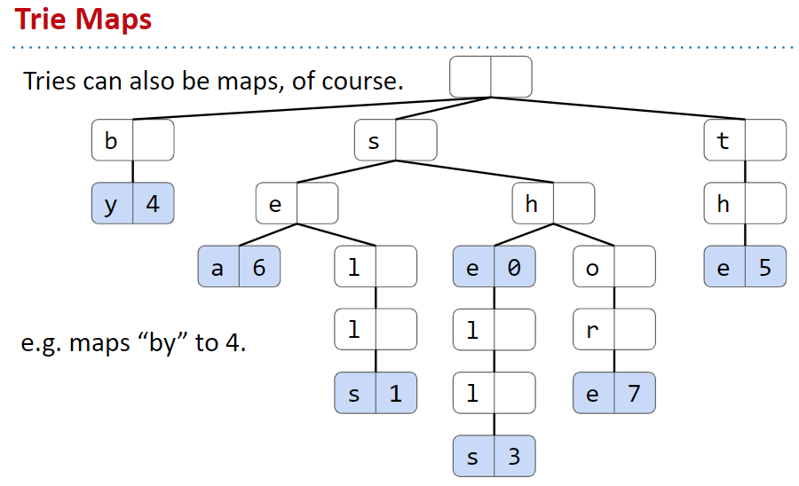

# Trie

Have to decide on a mapping from letter to node. Three natural choices:
- DataIndexedCharMap, i.e. an array of all possible child links.
- Bushy BST.
- Hash Table.

Tries have very fast lookup times, as we only ever look at as many characters as they are in the data we’re trying to retrieve. However, their chief advantage is the ability to efficiently support various operations not supported by other map/set implementations including:

- longestPrefixOf
- prefixMatches
- spell checking

Supports special string operations like longestPrefixOf and keysWithPrefix.
- keysWithPrefix is the heart of important technology like autocomplete.
  - Optimal implementation of Autocomplete involves use of a priority queue!
